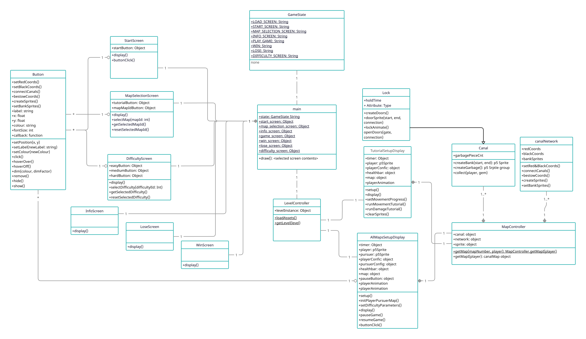
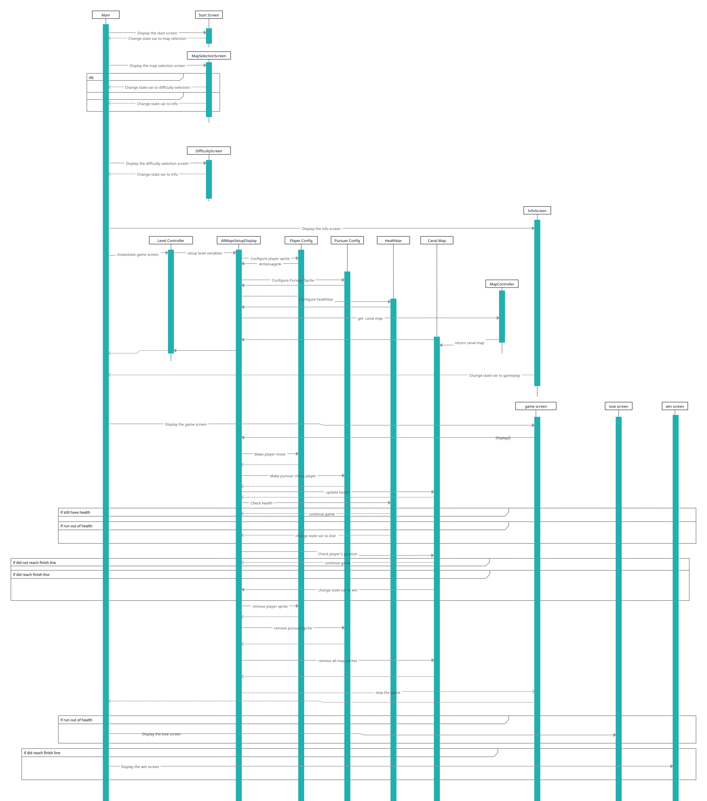

# 2025-group-14
2025 COMSM0166 group 14

## Link to game prototype

[Narrowboat game demo](https://uob-comsm0166.github.io/2025-group-14/)

## Link to Kanban board (Jira)

[Kanban board](https://bristol-team-bmscl43v.atlassian.net/jira/software/projects/SO/boards/1?cloudId=1256e9a6-2479-47c4-9fb8-bf1054da7034&atlOrigin=eyJpIjoiNGM4NmY3MWQwYTMwNGJjMjg0YjFlOTNhMDM5NzJmNDkiLCJwIjoiaiJ9)

## Your Game

Link to your game [PLAY HERE](https://uob-comsm0166.github.io/2025-group-14/)

Your game lives in the [/docs](/docs) folder, and is published using Github pages to the link above.

Include a demo video of your game here (you don't have to wait until the end, you can insert a work in progress video)

## Your Group

Add a group photo here!

| Name | Email | Role |
|----|-----|------|
| Polly Lang | js24119@bristol.ac.uk | developer |
| Leon Wellstead | np24094@bristol.ac.uk | developer |
| Casey Cronyn | mt24200@bristol.ac.uk | developer |
| Daniil Lutskiy | ya24711@bristol.ac.uk | developer |
| Leah Liddle | zs24945@bristol.ac.uk | developer |
| Adam Sidnell | fv24034@bristol.ac.uk | developer |

## Project Report

### Introduction

- 5% ~250 words 
- Describe your game, what is based on, what makes it novel?

#### Game ideas

##### Idea 1: Canal chase game
[Paper Prototype](https://www.youtube.com/watch?v=piU6QgTMxiM)

Top down lightly humorous chase game where you, on a canalboat, must flee a pursuing canalboat, across a top-down map. In addition to dodging your pursuer’s AI, you must master such mechanics as: rounding tight corners (ideally overcoming some very basic physics challenges; this is a secondary priority to AI pursuit mechanics), filling and emptying locks (can slow you or your pursuers down depending on how you time them), canal economics (keep yourself refuelled at chandleries as you pass them) and staying on top of repairs (your boat will need fixing every so often. Either stop and deal with repairs as they come, or keep going forwards until they build up and bring you to a complete halt). 

##### Idea 2: Robot Platformer
[Paper Prototype](https://youtube.com/shorts/YePgMwbQUTk?si=Ox-Gx0sC_hZafTdL)

Platformer style game where you are an Android in the year 2442. An evil conglomerate has stolen parts from you and your mission is to get these back before it's too late and you become obsolete. Along the way you have to go through levels and solve small puzzles and problems to progress. Problems to deal with include lasers, trap doors, and traps. The tools at your disposal include jet packs, teleportation and hacking. These are upgrades that you get as you find the parts and progress through the levels.

### Requirements 

- 15% ~750 words
- Use case diagrams, user stories. Early stages design. Ideation process. How did you decide as a team what to develop?

[Game Requirements - stakeholders, epics, user stories and acceptance criteria](https://github.com/UoB-COMSM0166/2025-group-14/blob/main/Requirements/GameRequirements.txt)

[Testing Session feedback on game requirements - positive feedback, confusing aspects and potential improvements to concept](https://github.com/UoB-COMSM0166/2025-group-14/blob/main/Requirements/TestingSessionFeedback.md)

#### Stakeholders

- Markers
- Developers (us)
- Prospective gamers - friends and family
- Prospective gamers - testers (at testathons)
- Prospective gamers - boaters/enthusiasts
- Prospective gamers - other;

#### Epics

| Stakeholder | Epic |
|---|---|
| Markers | As markers, we want a game that is based around unique mechanics to demonstrate the developers' capabilities.|
| Developers | As developers, we want a game that is easily implementable so that we can complete it within the timeframe.|
|Prospective gamers - friends and family| As friends and family, we want a game that is intutive so that it is easy for casual gamers or new gamers to play.|
|Prospective gamers - testers| As testers, we want a game that is stable so that it will not crash even as we try to break it. |
|Prospective gamers - boaters/enthusiasts| As boaters/enthusiasts, we want a game that captures the tone and feel of the canals.|
|Prospective gamers - other| As prospective gamers, we want a game that is fun to play.|

#### User stories

| Stakeholder | User story | Acceptance crteria |
|---|---|---|
| Markers |As markers, we want the challenge of overcoming map hazards to synergize with damage and pursuit so it can be assessed as a cohesive test of player strategy and thus a "twist".|Given control over the boat avatar and awareness of hazards and the pursuer, when I employ a clear strategy based on game mechanics, I should be able to complete the game.|
| Developers |As developers, we want modular game design based around  the interactions between objects so that they can be worked on seperately and we can thus divide tasks among our team members.|Given that we are assigned individual objects and mechanics to work on, when we merge branches, these mechanics should interact with minimal refactoring.| 
|Prospective gamers - friends and family|As a friend or family of the developers, I want a WASD or arrow-key control system so that I can navigate the boat.|Acceptance Criteria: Given that I have access to a keyboard while playing the game, when I press a button to move the boat avatar, the on-screen boat should move in an expected way.|
|Prospective gamers - friends and family|As a friend or family of the developers, I want instructions so that I can play the game.|Given that I have started up the game myself and seen the loading/introductory screen, when I start gameplay, I should not be confused as to controls or aims.|
|Prospective gamers - testers|As testers, we want the game to have gone through internal testing process so that breaking it will pose a challenge to us.|Given that the game has been submitted to a testathon, when a tester attempts to break it, it should not break.|
|Prospective gamers - boaters/enthusiasts|As a boating enthusiast I want a map that is interestingly shaped to provide a sense of exploration.|Given some familiarity with the English countryside, while playing the game, I should be able to recognise locks, winding holes and fields.|
|Prospective gamers - boaters/enthusiasts|As a boating enthusiast, I want the mechanics to feel verasimilitudinous to boat life.|Given that this avatar is a boat, when the player moves it, it should make the motions of a vessel that turns and advances rather than strafing.|
|Prospective gamers - other|As a player of the game I want a map I can navigate in order to encounter structured challenges.|Given that I have been playing the game for a certain amount of time, when I overcome a level hazard it should have required a greater mastery of the game's mechanics than overcoming a challenge when having played the game for less time.|
|Prospective gamers - other|As a player of the game I want to encounter locks as a map hazard so that there is challenge|Given that locks slow down both the player avatar and the pursuer, when I encounter one on the map, successful employment of other game mechanics should determine whether I am able to pass it or whether it causes me to lose the game.|
|Prospective gamers - other|As a player of the game I want to track and address damage to the boat so that there is a challenge|Given that my boat has taken damage, when I need to strategize in order to beat the game, I should be able to see the damage level and have some option to repair it.|
|Prospective gamers - other|As a player of the game I want to be pursued by an opponent with an increasing skill/power/speed level to keep the challenge consistently fresh.|Given that the game has been played for some time, when the enemy AI moves, it should be operating with a distinct AI algorithm from the starting AI that accounts for more player behaviours.| 
|Prospective gamers - other|As a player of the game I want a map that contains routes and hazards to reward strategic thinking|Given that the player has progressed beyond the very opening stages of the game, when the player makes a choice to move the boat in a particular direction, this should be an enactment of a player strategy rather than progression down a linear route.|
|Prospective gamers - other|As a plyaer of the game I want it to have a small narrative component to provide context.|Given that I have watched the game's introduction, when I see the enemy avatar approach, I should be able to say why they are chasing me and what the stakes are for my hypothetical player character.|

### Requirements Reflection
Initially, for certain cases, we had difficulty distinguishing between the Initiative, Epic, and User Story, as each one requires a different level of specificity -- a level which may vary between different teams due to factors such as the length of their sprints. However, we quickly established that our sprints will be short (not more than one week), and that the categories should be thought of as follows:

(1) **Initiative** = largest overview/goal; it is made up of several Epics.

(2) **Epic** = more narrow scope than an Initiative but large enough that it takes several sprints to complete; it is made up of several user stories.

(3) **User Story** = even more specific than an Epic and must be achievable within a single sprint.

(4) **Acceptance Criteria** = a pre-determined set of expectations/outcomes which is retrospectively measured against a specific user story, to ensure that what was promised has been fulfilled.

Another helpful lesson which Ruzanna mentioned to us is that if a particular Acceptance Criteria depends on something else that is not in the corresponding story, it could mean that it should be broken down into multiple stories. This way, each story can be developed independently, and the epic can be delivered incrementally. This modularity is important because development could otherwise become inefficient.

When establishing the requirements in the specific context of our game, we quickly realised the utility of Agile development, as it can be difficult to know upfront what all the requirements will be. We focused on prioritising the most important aspects of the game. For example, developing fluid and intuitive movement for the boat which the user controls, and not worrying yet about less pressing nice-to-have features like sound effects. As a team, we find the prioritisation matrix below to be a useful tool and reminder of what to work on next.

Source: https://www.productplan.com/glossary/2x2-prioritization-matrix/

### Design

- 15% ~750 words 
- System architecture. Class diagrams, behavioural diagrams.

#### UML Class Diagram

This is my first stab at a class diagram. We can update it once we've consolidated the core features and/or planned which features to implement next. For now, it's just a rough and ready template.

### Implementation

- 15% ~750 words

- Describe implementation of your game, in particular highlighting the three areas of challenge in developing your game. 

### Evaluation

- 15% ~750 words

#### Qualitative Evaluation

##### 'Thinking Aloud' Evaluation

We have split our evaluation into three sections – the first two being feedback from the user, and the last being our team’s analysis of the feedback: 
(1) Constructive Criticism; (2) Positives; (3) Analysis, based on the user’s feedback.

**(1) Constructive Criticism**
- Corners difficult to navigate with current movement mechanics. Glitches occur on corner collisions; and too much bounce when colliding with the walls of the canals.
- Pursuer too fast and/or starts too close to the Player.
- The player did not feel in direct control of the movement; there is a learning curve to navigate the corners without crashing and being caught by the pursuer.
- Repair function not very intuitive and too slow to repair.
- Health bar too small; bigger bar would be easier to notice.
- More small bends would be good, not just straight lines.
- How do you win the game? Unclear objective.

**(2) Positives**
- Map shape was interesting because of the sharp corners.
- Original game idea; never played a game like it before.
- User liked the top-down birds eye view as they could see the entire map on the screen and therefore see upcoming corners.
- Aesthetics (boats and water texture) received compliments. 

**(3) Analysis**
- We need to improve collision detection between the player and canal walls. Collisions occur when they should not; being close to the corner as you go around it, but not actually touching the wall, may register as a collision and bounce the player back. This has a big impact on the user’s experience and is therefore high priority.
- We should consider reducing the amount which the player bounces away from the wall when they collide.
- A simple tutorial on the controls and objective(s) of the game would make the experience more enjoyable and reduce the learning curve.
- We could also add sound to collisions and when health goes down to, for example, 50%, to make the game more immersive and make it clearer to the player that they are losing health. The tutorial would also help with this.
- We should consider adding multiple levels with varying skill levels for the AI pursuer, so that the player has a chance to get used to the game with a slower pursuer and once they get a feel for the movement of the boat they can progress and have a faster pursuer chasing them. Scaling the difficulty can help us cater to inexperienced and seasoned gamers alike.
- To produce a more difficult level, we can change the camera to scroll the map into view instead of showing the entire map on the screen; not seeing upcoming corners will make it more difficult.

##### Heuristic Evaluation

| Interface     | Issue         | Heuristics    |Frequency (0-4)| Impact (0-4)  |Persistence (0-4)| Severity (0-4)|
| ------------- |-------------  | ------------- |:-------------:|:-------------:| :-------------: |:-------------:|
| Repairs & visuals | The mechanic of the boat freezing after a repair requires you to start moving again but this is not visually indicated | Visibility of system status | 3 | 2 | 1 | 2 |
| Canal | Enemy boat goes through walls instead of colliding | Error prevention | 1 | 1 | 1 | 1 | 
| Controls | It is hard to turn on sharp corners, especially when boat is at speed | User control and freedom | 2 | 2 | 1 | 2 |
| Canal | Invisible walls mean turning is not always possible but this is not evident to the player | Error prevention | 2 | 3 | 1 | 2 |
| Instructions | It is not immediately obvious how to turn or use the repair. Need clear instructions before the game starts | Help and documentation | 0 | 3 | 1 | 2 |

The feedback from our heuristic evaluation highlighted several usability issues across different components of our game. Broadly, we found that some players struggled with unclear instructions, particularly for turning and repairs, which we plan to address with clearer on-screen prompts and tutorials. We also noted issues with invisible walls affecting turning, alongside difficulty navigating sharp corners at high speeds. Both issues fall under error prevention and user control, suggesting the need for improved visual cues and better control mechanics. To tackle these we will refine the control system and attempt to debug issues with collisions.

#### Quantitative Evaluation

##### System Useability Survey (SUS)

| SUS Question | Average SUS Score (Easy) | Average SUS Level (Difficult) |
|---|---|---|
| 1 | 65 | 47.5 |
| 2 |	55 | 65 |
| 3	| 80 | 72.5 |
| 4	| 85 | 72.5 |
| 5	| 65 | 62.5 |
| 6	| 82.5 | 77.5 |
| 7	| 55 | 35 |
| 8	| 90 | 82.5 |
| 9	| 57.5 | 65 |
| 10 |87.5 | 80 |
| **Average** | **72.25** | **66** |

Upon applying the Wilcoxon Signed Rank Test on the data, a W-statistic of 11.5 was obtained. For n = 10 and at a significance level of 0.05, this  value is greater than the critical value of 8, indicating a statistically significant difference in the useability scores between the two levels.

A more granular analysis of the raw data showed that particularly large contributions to the useability score came from Questions 4, 7, and 10 for both levels. These questions are:
- I think that I would need the support of a technical person to be able to use this system. (4)
- I would imagine that most people would learn to use this system very quickly. (7)
- I needed to learn a lot of things before I could get going with this system. (10)

Question 2 also made a fairly large contribution to the SUS for the easy level:
- I found the system unnecessarily complex. (2)

These large contributions indicate that currently the useability (or lack thereof) of the system may be dominated by the lack of instruction and information provided to the player when they start the game. We (the developers) needed to tell them quite a lot of information before they could start, and most of the testers took a few moments to get to grips with the controls. However, the large contribution from Question 7 ("I would imagine that most people would learn to use this system very quickly") suggests that once they have absorbed and understood how to use the system, they find it easy to use. 

Based on this, we can conclude that there is a satisfactorily significant difference between the different levels of the game. However, considerable gains in useability for both levels could be achieved by implementing methods to provide more information to the user about how to play the game and use the controls at the outset, for example, text explanations and/or tutorials. 

##### NASA Task Load Index (TLX)

| TLX Question | W value | Sample size | Result significance (at p<0.5) |
|---|---|---| ---|
| Mental Demand | 0 | 9 | significant |
| Physical Demand | 7.5 | 8 | not significant |
| Temporal Demand | 24 | 10 | not significant |
| Effort | 2.5 | 10 | significant |
| Performance | 5 | 9 | significant |
| Frustration | 8 | 10 | significant |

**Mental demand & Effort:** 

The result was expectedly statistically significant, because increasing the difficulty level implies putting more effort into game play.  Moreover, both tests were redone with the p=0.01, and the difference in means of the 2 groups was still statistically significant

**Physical demand:**

Expectedly, the difference between the groups was not statistically significant, because in each case the controls for the player’s character were the same, i.e. pressing arrow keys for the boat movement.

**Temporal demand:**

Expectedly, the difference between the groups was not statistically significant, because there was no time limit in completing the task in each case. 

**Performance:**

We expected the difference not to be statistically significant because of the way the nature of the task (make n number of laps around a circle track). However, the players reported feeling that they completed the task more successfully on a difficult level than on the easy level. This result could not be explained by participants getting accustomed to the game play mechanics, because the order of difficulty (easy then hard or vice versa) was randomised.

**Frustration:**

At the time of conducting the testing we had unfixed bugs appearing randomly during the gameplay, which players might find unfair. Increased frustration at higher levels could have been induced by greater unjustified punishment.

### Sustainability Analysis

We conducted an analysis of the sustainability impacts of our game, based on the Sustainability Awareness Framework (https://www.suso.academy/en/sustainability-awareness-framework-susaf/).

This was measured across five dimensions of sustainability: (1) Individual, (2) Social, (3) Environmental, (4) Economic, (5) Technical, and across three temporal dimensions: Immediate, Enabling (medium-term), and Structural (longer-term).

We concluded that the economic and technical impacts were less significant and therefore have focused on the other three in greater depth.

**(1) Individual impact**
The engaging and enjoyable gameplay may relieve stress and provide mental health benefits, as well as offering cognitive stimulation. The player is able to strategise about the route they take through the canal system and how they make use of the locks to escape from the pursuer; we believe player agency is key to an immersive and enjoyable gaming experience.

To ensure that our game does not have a negative impact on health due to prolonged playing sessions, like eye strain or fatigue, we implemented a 30-minute timer that encourages the user to take a break. Also, the player can pause the game at any point in their session, as we wanted to avoid situations where the player is forced to complete the level they are currently playing before they can pause the game and take a break. 

Additionally, there is an element of learning and environmental literacy in our game, which is especially important for encouraging future generations to be conscious of their impact on the environment and how they can make a positive contribution. In our game, players can pick up a variety of litter that is floating in the canal to slow down the pursuer and gain an advantage, thereby reinforcing positive behaviour with a reward, without forcefully pushing the message and interrupting the gameplay.

Lastly, no personal data is collected as it is unnecessary for the purposes of our game. While this means you cannot save your progress, we decided it was worth the tradeoff as the game is quick and easy to jump into without a login process, and the user maintains complete privacy.

**(2) Social impact**
The backstory we initially came up with for our game was problematic because it could negatively impact inclusiveness and diversity and people’s sense of belonging/community. Our initial backstory was that the player is a drug smuggler and is being chased by the police through the canals. Although this is a provocative and interesting setting, and suits the “chase” theme of this game, it could negatively impact public perception of boat owners in the UK and further marginalise people in that community who do not associate with this kind of image and lifestyle.

Although trends show a rapidly growing ownership of canal boats over the last decade (https://www.economist.com/britain/2024/10/31/a-growing-number-of-britons-live-on-canal-boat), with around 35,000 boats on canals in England and Wales, our game still represents a niche part of British history, culture and society, which is underrepresented. We now recognise the responsibility that comes with creating a game, or any kind of media, that represents a specific community (especially one that is a minority), and have therefore decided to change the messaging of our game moving forward. Moving forward, we are looking to change the backstory/theme of our game to something with more positive messaging (e.g. turning it into a historic canal race, akin to the Goodwood Revival, which is a historic motorsport festival).

**(3) Environmental impact**
The active development of our game, and hosting, contributes to electricity usage and energy consumed by data centers, plus all of the hardware required throughout the entire process across production, deployment, and operation. However, our game is small relative to many other games, so the impact is likely miniscule. We are also confident that choosing GitHub as our hosting provider will offset some of these impacts, due to their strong commitment to environmental sustainability. (https://github.com/social-impact/focus-areas/environmental-sustainability)

There is potential for our game to positively support canal biodiversity by ensuring we convey messages about environmental awareness and sustainability through the gameplay, as mentioned in the Individual and Social sections above. In the long-term, if the number of players grows to a substantial size and we continue developing the game in a way that promotes such messaging, the game could contribute to a greater awareness and appreciation of British canals and public support for canal preservation. This may also lead to an increase in tourism, both domestic and international. And while heavy pedestrian traffic may negatively impact canal biodiversity, we hope that those who were attracted to the canals because of our game will keep in mind the importance of preserving those canals. 

Chain of Effects diagram
Below is a diagram which shows the potential chains of effect that may happen when many people use this product over several years.

#### Green Software Patterns

In an effort to reduce our software emissions, we have implemented three "Green Software Patterns", reviewed and curated by the Green Software Foundation (https://patterns.greensoftware.foundation/).

**(1) Avoid tracking unnecessary data**
We have designed our game in a way that does not ask for any data from the user, thereby reducing the overall workload for page loads, decreasing overall page weight of the site, and protecting and preserving the user’s privacy.

**(2) Remove unused CSS definitions**
We maintain a single CSS file to reduce the amount of requests and amount of time the browser needs to retrieve all CSS definitions at once, and ensure that any unused CSS definitions are removed.

**(3) Remove unused assets**
We regularly (after each sprint and integration) scan the assets we are storing and remove any unused assets.

### Process 

- 15% ~750 words

- Teamwork. How did you work together, what tools did you use. Did you have team roles? Reflection on how you worked together. 

### Conclusion

- 10% ~500 words

- Reflect on project as a whole. Lessons learned. Reflect on challenges. Future work. 

### Contribution Statement

- Provide a table of everyone's contribution, which may be used to weight individual grades. We expect that the contribution will be split evenly across team-members in most cases. Let us know as soon as possible if there are any issues with teamwork as soon as they are apparent. 

### Additional Marks

You can delete this section in your own repo, it's just here for information. in addition to the marks above, we will be marking you on the following two points:

- **Quality** of report writing, presentation, use of figures and visual material (5%) 
  - Please write in a clear concise manner suitable for an interested layperson. Write as if this repo was publicly available.

- **Documentation** of code (5%)

  - Is your repo clearly organised? 
  - Is code well commented throughout?
