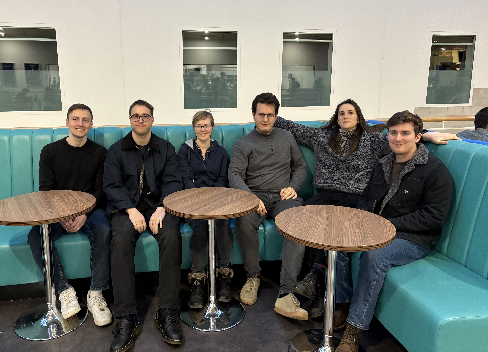
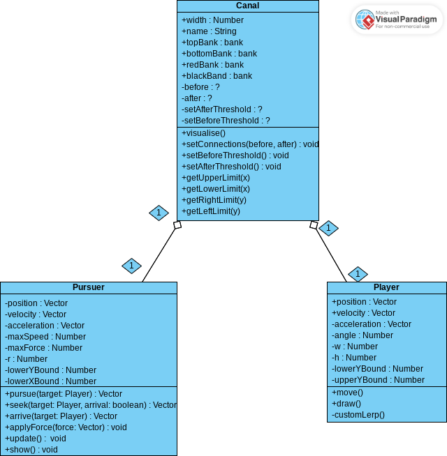

# 2025-group-14
2025 COMSM0166 group 14

## Link to game prototype

[Narrowboat game demo](https://uob-comsm0166.github.io/2025-group-14/)

## Link to Kanban board (Jira)

[Kanban board](https://bristol-team-bmscl43v.atlassian.net/jira/software/projects/SO/boards/1?cloudId=1256e9a6-2479-47c4-9fb8-bf1054da7034&atlOrigin=eyJpIjoiNGM4NmY3MWQwYTMwNGJjMjg0YjFlOTNhMDM5NzJmNDkiLCJwIjoiaiJ9)

## Your Game

Link to your game [PLAY HERE](https://uob-comsm0166.github.io/2025-group-14/)

Your game lives in the [/docs](/docs) folder, and is published using Github pages to the link above.

Include a demo video of your game here (you don't have to wait until the end, you can insert a work in progress video)

## Your Group

Add a group photo here!

| Name | Email | Role |
|----|-----|------|
| Polly Lang | js24119@bristol.ac.uk | developer |
| Leon Wellstead | np24094@bristol.ac.uk | developer |
| Casey Cronyn | mt24200@bristol.ac.uk | developer |
| Daniil Lutskiy | ya24711@bristol.ac.uk | developer |
| Leah Liddle | zs24945@bristol.ac.uk | developer |
| Adam Sidnell | fv24034@bristol.ac.uk | developer |

## Project Report

### Introduction

- 5% ~250 words 
- Describe your game, what is based on, what makes it novel?

#### Game ideas

##### Idea 1: Canal chase game
[Paper Prototype](https://www.youtube.com/watch?v=piU6QgTMxiM)

Top down lightly humorous chase game where you, on a canalboat, must flee a pursuing canalboat, across a top-down map. In addition to dodging your pursuer’s AI, you must master such mechanics as: rounding tight corners (ideally overcoming some very basic physics challenges; this is a secondary priority to AI pursuit mechanics), filling and emptying locks (can slow you or your pursuers down depending on how you time them), canal economics (keep yourself refuelled at chandleries as you pass them) and staying on top of repairs (your boat will need fixing every so often. Either stop and deal with repairs as they come, or keep going forwards until they build up and bring you to a complete halt). 

##### Idea 2: Robot Platformer
[Paper Prototype](https://youtube.com/shorts/YePgMwbQUTk?si=Ox-Gx0sC_hZafTdL)

Platformer style game where you are an Android in the year 2442. An evil conglomerate has stolen parts from you and your mission is to get these back before it's too late and you become obsolete. Along the way you have to go through levels and solve small puzzles and problems to progress. Problems to deal with include lasers, trap doors, and traps. The tools at your disposal include jet packs, teleportation and hacking. These are upgrades that you get as you find the parts and progress through the levels.

### Requirements 

- 15% ~750 words
- Use case diagrams, user stories. Early stages design. Ideation process. How did you decide as a team what to develop?

[Game Requirements - stakeholders, epics, user stories and acceptance criteria](https://github.com/UoB-COMSM0166/2025-group-14/blob/main/Requirements/GameRequirements.txt)

[Testing Session feedback on game requirements - positive feedback, confusing aspects and potential improvements to concept](https://github.com/UoB-COMSM0166/2025-group-14/blob/main/Requirements/TestingSessionFeedback.md)

#### Stakeholders

- Markers
- Developers (us)
- Prospective gamers - friends and family
- Prospective gamers - testers (at testathons)
- Prospective gamers - boaters/enthusiasts
- Prospective gamers - other;

#### Epics

| Stakeholder | Epic |
|---|---|
| Markers | As markers, we want a game that is based around unique mechanics to demonstrate the developers' capabilities.|
| Developers | As developers, we want a game that is easily implementable so that we can complete it within the timeframe.|
|Prospective gamers - friends and family| As friends and family, we want a game that is intutive so that it is easy for casual gamers or new gamers to play.|
|Prospective gamers - testers| As testers, we want a game that is stable so that it will not crash even as we try to break it. |
|Prospective gamers - boaters/enthusiasts| As boaters/enthusiasts, we want a game that captures the tone and feel of the canals.|
|Prospective gamers - other| As prospective gamers, we want a game that is fun to play.|

#### User stories

| Stakeholder | User story | Acceptance crteria |
|---|---|---|
| Markers |As markers, we want the challenge of overcoming map hazards to synergize with damage and pursuit so it can be assessed as a cohesive test of player strategy and thus a "twist".|Given control over the boat avatar and awareness of hazards and the pursuer, when I employ a clear strategy based on game mechanics, I should be able to complete the game.|
| Developers |As developers, we want modular game design based around  the interactions between objects so that they can be worked on seperately and we can thus divide tasks among our team members.|Given that we are assigned individual objects and mechanics to work on, when we merge branches, these mechanics should interact with minimal refactoring.| 
|Prospective gamers - friends and family|As a friend or family of the developers, I want a WASD or arrow-key control system so that I can navigate the boat.|Acceptance Criteria: Given that I have access to a keyboard while playing the game, when I press a button to move the boat avatar, the on-screen boat should move in an expected way.|
|Prospective gamers - friends and family|As a friend or family of the developers, I want instructions so that I can play the game.|Given that I have started up the game myself and seen the loading/introductory screen, when I start gameplay, I should not be confused as to controls or aims.|
|Prospective gamers - testers|As testers, we want the game to have gone through internal testing process so that breaking it will pose a challenge to us.|Given that the game has been submitted to a testathon, when a tester attempts to break it, it should not break.|
|Prospective gamers - boaters/enthusiasts|As a boating enthusiast I want a map that is interestingly shaped to provide a sense of exploration.|Given some familiarity with the English countryside, while playing the game, I should be able to recognise locks, winding holes and fields.|
|Prospective gamers - boaters/enthusiasts|As a boating enthusiast, I want the mechanics to feel verasimilitudinous to boat life.|Given that this avatar is a boat, when the player moves it, it should make the motions of a vessel that turns and advances rather than strafing.|
|Prospective gamers - other|As a player of the game I want a map I can navigate in order to encounter structured challenges.|Given that I have been playing the game for a certain amount of time, when I overcome a level hazard it should have required a greater mastery of the game's mechanics than overcoming a challenge when having played the game for less time.|
|Prospective gamers - other|As a player of the game I want to encounter locks as a map hazard so that there is challenge|Given that locks slow down both the player avatar and the pursuer, when I encounter one on the map, successful employment of other game mechanics should determine whether I am able to pass it or whether it causes me to lose the game.|
|Prospective gamers - other|As a player of the game I want to track and address damage to the boat so that there is a challenge|Given that my boat has taken damage, when I need to strategize in order to beat the game, I should be able to see the damage level and have some option to repair it.|
|Prospective gamers - other|As a player of the game I want to be pursued by an opponent with an increasing skill/power/speed level to keep the challenge consistently fresh.|Given that the game has been played for some time, when the enemy AI moves, it should be operating with a distinct AI algorithm from the starting AI that accounts for more player behaviours.| 
|Prospective gamers - other|As a player of the game I want a map that contains routes and hazards to reward strategic thinking|Given that the player has progressed beyond the very opening stages of the game, when the player makes a choice to move the boat in a particular direction, this should be an enactment of a player strategy rather than progression down a linear route.|
|Prospective gamers - other|As a plyaer of the game I want it to have a small narrative component to provide context.|Given that I have watched the game's introduction, when I see the enemy avatar approach, I should be able to say why they are chasing me and what the stakes are for my hypothetical player character.|

#### Requirements Reflection
Initially, for certain cases, we had difficulty distinguishing between the Initiative, Epic, and User Story, as each one requires a different level of specificity -- a level which may vary between different teams due to factors such as the length of their sprints. However, we quickly established that our sprints will be short (not more than one week), and that the categories should be thought of as follows:

(1) **Initiative** = largest overview/goal; it is made up of several Epics.

(2) **Epic** = more narrow scope than an Initiative but large enough that it takes several sprints to complete; it is made up of several user stories.

(3) **User Story** = even more specific than an Epic and must be achievable within a single sprint.

(4) **Acceptance Criteria** = a pre-determined set of expectations/outcomes which is retrospectively measured against a specific user story, to ensure that what was promised has been fulfilled.

Another helpful lesson which Ruzanna mentioned to us is that if a particular Acceptance Criteria depends on something else that is not in the corresponding story, it could mean that it should be broken down into multiple stories. This way, each story can be developed independently, and the epic can be delivered incrementally. This modularity is important because development could otherwise become inefficient.

When establishing the requirements in the specific context of our game, we quickly realised the utility of Agile development, as it can be difficult to know upfront what all the requirements will be. We focused on prioritising the most important aspects of the game. For example, developing fluid and intuitive movement for the boat which the user controls, and not worrying yet about less pressing nice-to-have features like sound effects. As a team, we find the prioritisation matrix below to be a useful tool and reminder of what to work on next.

Source: https://www.productplan.com/glossary/2x2-prioritization-matrix/

### Design

- 15% ~750 words 
- System architecture. Class diagrams, behavioural diagrams.

#### UML Class Diagram

This is my first stab at a class diagram. We can update it once we've consolidated the core features and/or planned which features to implement next. For now, it's just a rough and ready template.

### Implementation

- 15% ~750 words

- Describe implementation of your game, in particular highlighting the three areas of challenge in developing your game. 

### Evaluation

- 15% ~750 words

- One qualitative evaluation (your choice) 

- One quantitative evaluation (of your choice) 

- Description of how code was tested. 

### Process 

- 15% ~750 words

- Teamwork. How did you work together, what tools did you use. Did you have team roles? Reflection on how you worked together. 

### Conclusion

- 10% ~500 words

- Reflect on project as a whole. Lessons learned. Reflect on challenges. Future work. 

### Contribution Statement

- Provide a table of everyone's contribution, which may be used to weight individual grades. We expect that the contribution will be split evenly across team-members in most cases. Let us know as soon as possible if there are any issues with teamwork as soon as they are apparent. 

### Additional Marks

You can delete this section in your own repo, it's just here for information. in addition to the marks above, we will be marking you on the following two points:

- **Quality** of report writing, presentation, use of figures and visual material (5%) 
  - Please write in a clear concise manner suitable for an interested layperson. Write as if this repo was publicly available.

- **Documentation** of code (5%)

  - Is your repo clearly organised? 
  - Is code well commented throughout?
