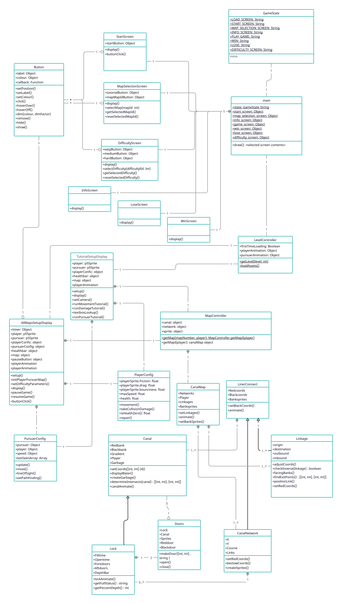
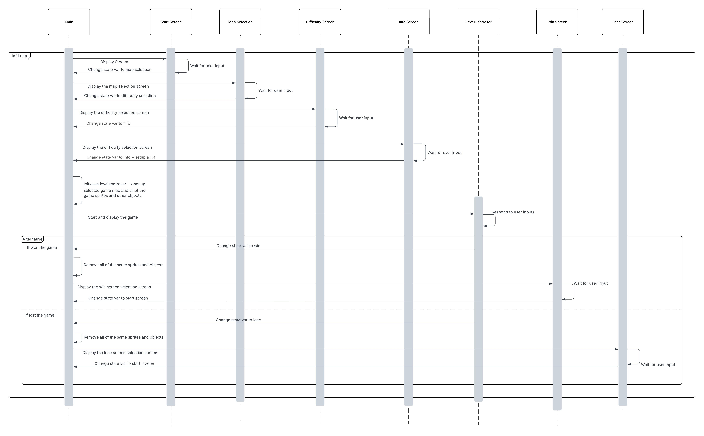
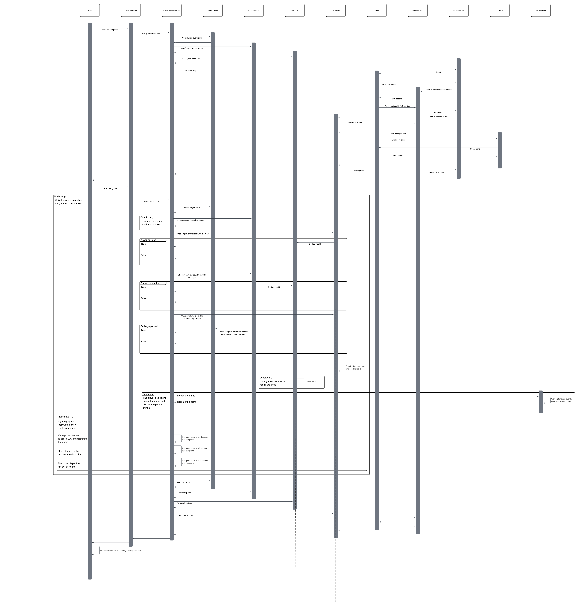
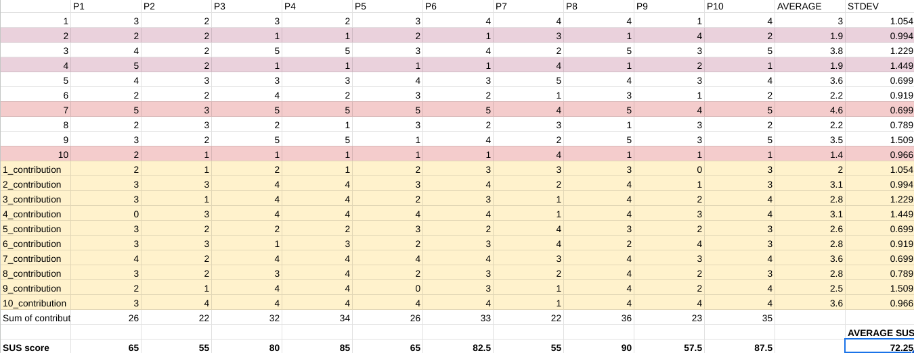
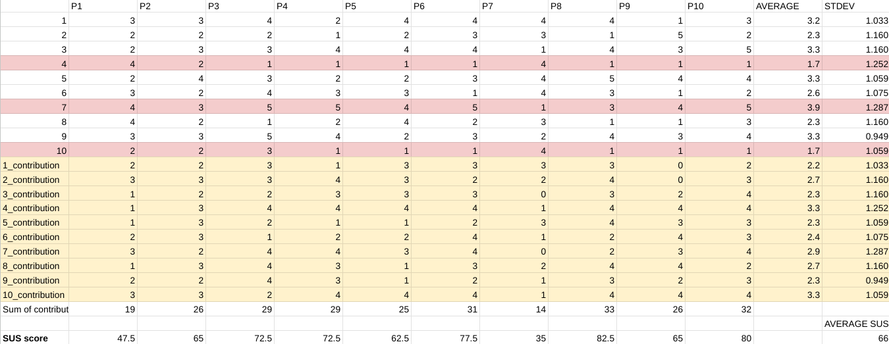
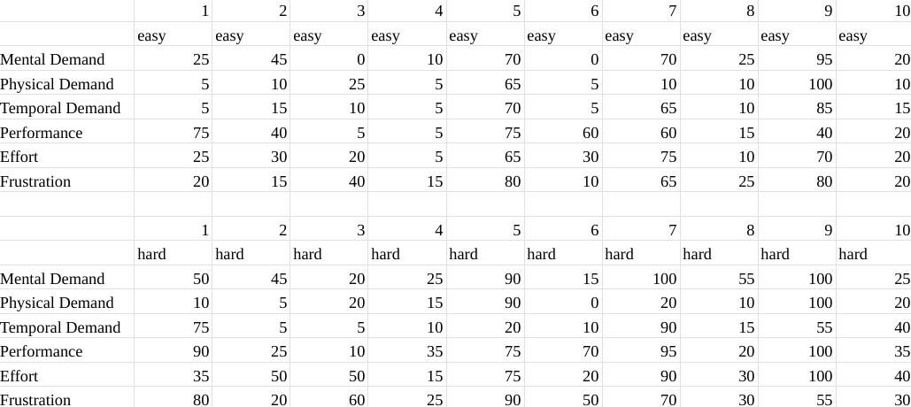

# 2025-group-14
2025 COMSM0166 group 14

## Link to game

[Narrowboat game demo](https://uob-comsm0166.github.io/2025-group-14/)

## Link to Kanban board (Jira)

[Kanban board](https://bristol-team-bmscl43v.atlassian.net/jira/software/projects/SO/boards/1?cloudId=1256e9a6-2479-47c4-9fb8-bf1054da7034&atlOrigin=eyJpIjoiNGM4NmY3MWQwYTMwNGJjMjg0YjFlOTNhMDM5NzJmNDkiLCJwIjoiaiJ9)

## Canal Chase

[TODO - ADD VIDEO OF GAME, ADD BANNER WITH GAME NAME, ADD GIFS]

## Group 14 - Team Snack Overflow 

| Name | Email | Role |
|----|-----|------|
| Polly Lang | js24119@bristol.ac.uk | developer |
| Leon Wellstead | np24094@bristol.ac.uk | developer |
| Casey Cronyn | mt24200@bristol.ac.uk | developer |
| Daniil Lutskiy | ya24711@bristol.ac.uk | developer |
| Leah Liddle | zs24945@bristol.ac.uk | developer |
| Adam Sidnell | fv24034@bristol.ac.uk | developer |

## Project Report

### Contents

- [1 – Introduction](#1---introduction)
  - [Game Ideas](#game-ideas)
- [2 – Requirements](#2---requirements)
  - [Identifying stakeholders](#identifying-stakeholders)
  - [Epics](#epics)
  - [User stories](#user-stories)
  - [Paper prototype](#paper-prototyping-and-early-stage-design)
  - [Requirements reflection](#requirements-reflection)
- [3 – Design](#3---design)
  - [Player](#player-sprite-playerconfig-class-and-player-mechanics)
  - [Pursuer](#pursuer-pursuerconfig-class-and-pursue-mechanics)
  - [Canals and locks](#canalmap-class-and-the-locks-mechanics)
  - [Health](#health-mechanic-the-interaction-between-canalmap-player-and-pursuer-objects)
  - [Difficulty setting](#game-difficulty-mechanic)
  - [User interface](#user-interface-classes)
  - [UML class diagram](#uml-class-diagram-of-the-entire-game)
  - [UML sequence diagrams](#uml-sequence-diagrams-of-non-gameplay-classes)
- [4 – Implementation](#4---implementation)
  - [Challenge 1](#challenge-1-building-the-canal-maps)
  - [Challenge 2](#challenge-2-movement-and-collision-mechanics)
- [5 – Evaluation](#5---evaluation)
  - [Qualitative (Think aloud)](#qualitative-evaluation)
  - [Quantitative (NASA TLX)](#quantitative-evaluation)
- [6 – Process](#6---process)
   - [Pair programming](#pair-programming)
   - [Tools (Jira, VS code, Git)](#jira)
- [7 – Sustainability, ethics and accessibility](#7---sustainability-ethics-and-accessibility)
    - [Green software patterns](#green-software-patterns)
- [8 – Conclusion](#8---conclusion)

### 1 - Introduction

Our game draws from the vehicle pursuit sections of titles like GTA but shifts the settings to the pastoral English canal network. Your boat must reach the end of a long, narrow waterway while avoiding by the pursuing vessel. As any boater will confirm, vessels need regular maintenance, so our unique mechanic is our health system: your boat, in addition to taking damage from collisions with the bank, will gradually incur damage over time. The player can, at any time, do “maintenance” to restore the boat to full health, at the cost of a 3 second stop. Repairing too frequently can thus make the player easy prey, while leaving it too late risks losing all health and failing. 

This is heightened by the presence of another classic feature of English waterways – locks! Locks open and close on a timer, and impede the progress of both player and pursuer. The game thus rewards strategic thinking: players are encouraged to pick routes and schedule maintenance breaks around lock opening times. 

Our game will have multiple maps and difficulty levels. Because the rate at which damage is incurred over time is partially randomized, we believe that even traversal of familiar maps will offer organic player-pursuer interactions, and the process of mastering a given map will not be linear. 

Pollution and garbage are known problems on the canal, and our game encourages players to remove randomized garbage sprites; taking time to do so slows down the pursuer.

#### Game ideas

##### Idea 1: Canal chase game
[Paper Prototype](https://www.youtube.com/watch?v=piU6QgTMxiM)

Top down lightly humorous chase game where you, on a canalboat, must flee a pursuing canalboat, across a top-down map. In addition to dodging your pursuer’s AI, you must master such mechanics as: rounding tight corners (ideally overcoming some very basic physics challenges; this is a secondary priority to AI pursuit mechanics), filling and emptying locks (can slow you or your pursuers down depending on how you time them), canal economics (keep yourself refuelled at chandleries as you pass them) and staying on top of repairs (your boat will need fixing every so often. Either stop and deal with repairs as they come, or keep going forwards until they build up and bring you to a complete halt). 

##### Idea 2: Robot Platformer
[Paper Prototype](https://youtube.com/shorts/YePgMwbQUTk?si=Ox-Gx0sC_hZafTdL)

Platformer style game where you are an Android in the year 2442. An evil conglomerate has stolen parts from you and your mission is to get these back before it's too late and you become obsolete. Along the way you have to go through levels and solve small puzzles and problems to progress. Problems to deal with include lasers, trap doors, and traps. The tools at your disposal include jet packs, teleportation and hacking. These are upgrades that you get as you find the parts and progress through the levels.

### 2 - Requirements 

[Game Requirements - stakeholders, epics, user stories and acceptance criteria](https://github.com/UoB-COMSM0166/2025-group-14/blob/main/Requirements/GameRequirements.txt)

[Testing Session feedback on game requirements - positive feedback, confusing aspects and potential improvements to concept](https://github.com/UoB-COMSM0166/2025-group-14/blob/main/Requirements/TestingSessionFeedback.md)

#### Identifying Stakeholders

We identified the stakeholders of our game as:
- Markers
- Developers (us)
- Casual Gamers
- Competitive Gamers
- Boat Owners/Enthusiasts
- Canal Preservation Organisations

#### Epics

| Stakeholder | Epic |
|---|---|
| Markers | We want unique game mechanics to demonstrate the developers' abilities.|
| Developers | We want a game which simulates the experience of driving a boat through canals. |
| Casual Gamers | We want a game that is intuitive so that it can be easily picked up and enjoyed |
| Competitive Gamers | We want a game that has unique game mechanics and difficult levels which involve mastering the game mechanics. |
| Boat Owners/Enthusiasts| We want a game that captures the tone and feel of real-life canals. |
| Canal Preservation Organisations | We want a game that promotes sustainability and the importance of keeping canals clean. |

#### User stories 

| Stakeholder | User story | Acceptance criteria |
|---|---|---|
| Markers |As markers, we want a functional and enjoyable game so that the students learn how to develop software in a team.|Given that the students show up to the demo day, when we play their game, we should find that the game is reasonably playable and enjoyable without any major issues.|
| Developers |As developers, we want modular game design, following Object-Oriented principles, so that we can divide tasks efficiently among our team members.|Given that we are assigned separate features and mechanics to work on, when we merge branches, the game should function with minimal refactoring.|
| Developers | As developers, we want to implement locks in the game, so that the game accurately represents canal systems. |Given I am moving through the map, when I encounter lock gates, then I should recognise it as a lock and know what its purpose is.|
| Casual gamer |As a casual player, I want simple instructions on how to play the game so that I’m not confused.|Given that I have started up the game, seen the introductory screen and been given the option to play through the tutorial, when I start playing the game I should not be confused about the controls or objective of the game.|
| Casual gamer |As a player, I want the game to have a backstory, so that the game feels more real and immersive.|Given that I have seen the game's introduction screen, when I see the enemy avatar approach, I should be able to say why they are chasing me and what the stakes are for my in-game character.|
| Competitive gamer |As a skilled gamer, I want to explore maps with challenges that reward strategic gameplay, so that I feel satisfaction from mastering the game mechanics.|Given that I have selected a difficulty level that matches my ability, when I encounter increasingly difficult maps, I should be able to complete them with some practice without being either bored or overexerted.|
| Boat owner/enthusiast |As a boating enthusiast, I want a map that represents real-life canals so that I feel a sense of familiarity and exploration.|Given some familiarity with the English countryside, while playing the game, I should be able to recognise locks, winding holes and fields.|
| Boat owners/enthusiasts |As a boating enthusiast, I want the mechanics to feel similar to the reality of boat life so that the game feels immersive.|Given that the player is controlling the boat, when the player moves it should make the motions of a vessel that turns and advances rather than strafing.|
| Canal Preservation Organisation |As an organisation concerned with the long-term preservation of canals, we want the game to have a mechanic which rewards picking up rubbish from the canal waters, so that players learn the importance of keeping canals clean.|Given that there is rubbish floating throughout the map, when players pick up the rubbish, then they should receive positive feedback that encourages them to continue picking up rubbish.|

#### Paper Prototyping and Early Stage Design

As a team, we made paper prototypes for both game ideas in order to quickly test our initial design ideas and provide us with an outline of our game ideation moving forward. Making the paper prototypes involved making some preliminary design decisions about user interface and gameplay mechanics, such as the movement controls, health/repair mechanics and the locks (the paper prototype also included some features that we did not end up implementing, such as a fuel guage and ability to refuel at chandleries). 

We later discussed during early team meetings what features to implement at each stage of development. We made a list of features broken down by category and assigned a value/effort estimation:
- First stage (core) features (essential to a working version of the game) - this included:
  - up/down/left/right movement controls (low effort)
  - canals with sides the player cannot cross (mid effort)
  - a pursuer (high effort)
  - movement mechanics (high effort)
- Second stage (extension) features included:
  - aesthetics of game - assets/images over boats, canal and background (medium effort)
  - damage/healthbar/repair mechanic (high effort)
  - canal locks (high effort)
  - refueling (this was not implemented due to prioritising other features)

These features constituted the first version of our product backlog (as represented by the To Do list of our Jira Kanban board), and roughly define work completed over the first and second sprints (first stage features were implemented in sprint 1 and second phase features were implemented in sprint 2, though this is overly simplistic as development of some features did overlap both sprints, and it does not allow for the extensive refactor undertaken between the two sprints).

#### Requirements Reflection
Initially we had some difficulty distinguishing between the Initiative, Epic, and User Story, as each one requires a different level of specificity - and this specificity may vary between different teams due to factors such as the length of their sprints. However, we quickly established that our sprints will be short (not more than one week), and that the categories should be thought of as follows:

(1) **Initiative** = largest overview/goal; one Initiative is made up of several Epics.

(2) **Epic** = more narrow scope than an Initiative but large enough that it takes several sprints to complete; one Epic is made up of several User Stories.

(3) **User Story** = even more specific than an Epic and must be achievable within a single sprint.

(4) **Acceptance Criteria** = a pre-determined set of expectations/outcomes which is retrospectively measured against a specific user story, to ensure that what was promised has been fulfilled.

Through the process of writing User Stories, we learned that if a particular Acceptance Criteria depends on something else that is not in the corresponding story, it should probably be broken down into multiple stories. This way, each story can be developed independently and more efficiently.

We also quickly recognized the utility of Agile development, as it can be difficult to know upfront what all the requirements will be. We focused on prioritising the most important and obvious requirements, and whenever we realised that we had to change certain features or add new features, we added it to our Kanban board and evaluated its priority. As a team, we found the prioritisation matrix below to be a useful tool and reminder of what to work on next.

Source: https://www.productplan.com/glossary/2x2-prioritization-matrix/

### 3 - Design

Following the main non-negotiable requirements, our team has implemented the game using JavaScript with p5.js and p5play libraries. One of the advantages of utilising JavaScript in an Agile software development team is building the application using Object Oriented Programming. Specifically, our team has extensively utilised aggregation (e.g. the button class) and composition (e.g. the playerConfig class) to create modular code, which allowed us to maintain, change or build upon existing modules easily without it affecting the general structure.   

Ever since the paper prototypes, the player, the pursuer and the map (consisting of the canal objects) were the foundational objects around which the game would be built. Over the cousre of many experiments and tests of interactionss between these three classes, we developed a range of game mechanics and helper classes to execute them, detailed below.
 
- #### Player sprite, playerConfig class and player mechanics  
 
The player p5play sprite is the central object in the game. The player directly controls the movement of sprite via the WASD keys. The behaviour of the object in response of the keypresses is implemented in a way to resemble a real life physical object, that has such attributes as mass and inertia.  
 
- #### Pursuer, pursuerConfig class and pursue mechanics  
 
The pursuer object is the same p5play sprite as the player, but without any player control; its behaviour is instead governed by pursuerConfig class. The config gives the sprite basic artificial intelligence to to trace the position of the player on the map and move towards its last recorded location.  
 
- #### CanalMap class and the locks mechanics  
 
Maps were built at three aggregated levels:
1.	Canals, straight line pairs of banks. 
2.	CanalNetworks, linear connections of canals.
3.	CanalMaps, aggregations of several networks into forking maps with a start and end point.
   
Canal objects are instantiated with a width, a length and an angle, but not position. CanalNetworks are given starting x and y coordinates and a set of ordered canals, and then draw these canals in the order starting from those coordinates. Canal networks are also passed a set of canal pairs, with the first canal necessarily being within the network but the second potentially being outside it. The map object takes these pairs and uses them to create linkage objects, a co-descendent (along with networks) of the linearConnect abstract class, that contains a single canal which is positioned by the map to link the canals specified by the networks. 
 
Locks, a subclass of canals, are given timing parameters and are positioned like any other canal via polymorphism. Lock doors open and close on an animation, allowing moments of tension as the player just makes it through a narrow gap ahead of the pursuer. A bar positioned beside the lock shows how full it is; doors open at one side when full, and at the other when empty. 
 
 
- #### Health mechanic: the interaction between canalMap, player and pursuer objects  
 
The main objective of the game is to navigate through the canals and reach the end of the track. To make the gameplay more involving, we have introduced a health mechanic, which both forces strategic thinking and punishes undesirable behavior. Health is decreased in the following situations:
1.	When the player hits the bank of a canal - this forces the player to be precise and slow when navigating the map, especially when handling tight corners and turns.
2.	When the pursuer catches up to the player - the sizeable penalty incurred here (as much as the player's full health bar on harder difficulties) is intended to be the most common game-over condition. This pushes the player to base their strategy around staying abreast of the pursuer. 
3.	At random intervals - a constant small amount of health is being constantly deducted to simulate real-world wear and tear of the boat, and to force the player to strategize around the repair function.  
 
- #### Game difficulty mechanic:   
 
To allow the game to be suited for a wide range of players with different gaming experiences, we have divided the game into three difficulty levels. Altering the difficulty level will affect the player's starting health amount, the amount of health deducted from bank collisions, the amount of hits from the pursuer that the player can withstand, and the degree to which garbage collection slows the pursuer down. It should be noted that individual maps also provide distinct player challenges, and players may sculpt the difficulty in accordance with their mastery of a particular skill: HarepinHampton, for example, rewards quick reflexes, while the Hedge Maze is a test of strategic thinking.  
 
- #### User Interface classes:  
 
The main non-gameplay features of the game are implemented as game screens, and either allow for game configuration game configuration (e.g. Map selection and difficulty level screens) or provide information and game control flow (e.g. Info screen or win/lose screens).

The transition between the screens that requires setting any parameter (e.g. map selection) is done via button class. Additionally, following the heuristic analysis report, a game pause and resume capability was added via the button UI.    

#### UML Class Diagram of the entire game

#### UML sequence diagrams of non-gameplay classes

#### UML sequence diagrams of gameplay classes

### 4 - Implementation

Two areas of challenge in developing our game were (1) the creation of the canal maps which included features such as forks and locks, and (2) the movement and collision mechanics of the game (including the pursuer AI), which necessitated a major refactor partway through our development process. These challenges are described below.

#### Challenge 1: Building the canal maps

We considered it prudent, as level traversal was a core player challenge in our game, to design levels based on canal objects, rather than “custom-build” objects for pre-planned levels. This meant our canals - essentially just parallel sets of barriers past
which the player could not move - had to be drawable at any angle and any connecting width, while remaining parallel, and not
overspilling. 

Initially, this requried the player object to track which canal object they were in and repeatedly check their coordinates against the cartesian functions of the banks, disabling playe controls when out of limits. This swiftly accumulated bugs as the player moved from a single point to a complex hitbox, and as we began to model interactions with the bank as damage-inducing collisions. These bugs may have been resolvable individually, but we were uncomfortable with the rate at which bugs were multiplying as our game became more complex. 

This was one of several factors which prompted a refactor around the P5play library, which provided us with sprites and a basic physics engine. Canals instead became simple pairs of straight-line sprites, trivializing all these bugs in one stroke. This decision was thoroughly vindicated, as designing banks that could connect at any angle proved to be a signficant challenge on its own. We eventually settled on a "redBank" and "blackBank" shorthand: our aggregating "network" class would position an initial "red" bank for each canal based on the angle and length of those canals, and then, at the junctions of each of these banks, position a pair of "black" banks based on the angle of intersection and the width of each canal. In addition to requiring complex trigonometric logic on its own, this presupposed linear routes, finding "black" coordinates by positioning each canal end-to-end. However, we considered forking and looping routes essential to our game. 

Our solution took two steps. First, CanalNetworks were given as an additional parameter a 2D array of canals that they wanted to "link" with additional connections. Second, CanalNetworks were aggreated into a new CanalMap object, which was given the power to automatically create its own canal objects based on these requested linkages via the "linkage" class, a one-canal network that uses polymorphic methods it inherits from the linearConnect superclass to instantiate a new canal based on entry and exit points in the linked canals. While it was initially hoped that linkages would be able to detect and elbow around obstacles, or connect from any point on specified canals, it was eventually decided that they would simply connect two canals in a straight line from their halfway point, and map designers would be responsible for only connecting sensibly positioned canals. 

While implementing the trigonometric functions necessary for canals to join at any angle, and automatically re-adjust their sprite coordinates to accommodate forks, was complex and time-consuming, this model ultimately paid dividends in late-development flexibility, as canals could be easily resized/re-angled during iterated playtests to create structured player challenges.

#### Challenge 2: Movement and collision mechanics

A challenge we had both before and after the refactor was the technical point of *how* the pursuer should chase the player. Initially, we used a system where the pursuer would simply "charge" the player without considering canal boundaries. The issue was that the pursuer could easily become stuck on the canal sides, meaning they were not a threat to the player.

One interesting solution we experimented with was an implementation of the [A* search algorithm](https://en.wikipedia.org/wiki/A*_search_algorithm), a highly efficient path finding algorithm that allows for traversal of mazes. However, it became clear that it would not work with the limitations of p5 play and the structure of canals. The algorithm works best in a system that has clearly defined "tiles" such as in games like Pacman. Since our canals are much more fluid and variable in size/shape it would be very difficult to systematically search all areas of the canal in a performant way. 

Instead, we implemented a vision-based system where the pursuer follows the player while in sight. If the player is lost, the pursuer heads to the last seen point and either chases the player (if visible) or pursues the next “last seen point” from the previous “last seen point”. This approach ensures efficient performance while maintaining intelligent pathfinding to keep the gameplay engaging.

### 5 - Evaluation

#### Qualitative Evaluation

In the quantitative evaluation, we used the Think Aloud empirical evaluation method to get feedback about the user experience of playing our game, and identify and issues. We asked participants to perform two tasks: (i) to complete two loops around our prototype circuit canal (under no contraints) and (ii) to complete the same loops but without being caught by the pursuing boat. As they did the tasks, a facilitator encouraged the participants to speak their thoughts out loud, describing their feelings and reactions to the gameplay in real time. Two observers recorded the feedback, and the team later discussed the results and categoried them into meaningful groupings.

The following describe the categories of contructive criticism we received from our participants, and the changes that we made to the game in response.

##### Issues with movement mechanics

This included various glitches/bug, trouble navigating corners, and too much bounce in collision with canal walls.

Specifically, users reported that:
- The corners were difficult to navigate with current movement mechanics. Glitches sometimes occur on corner collision.
- The player did not feel in direct control of the movement; there is a learning curve to navigate the corners without crashing and being caught by the pursuer.
- Users thought that there was too much bounce when colliding with the walls of the canals.

In response, We did a complete refactor of the game, overhauling how movement mechanics and collision mechanics were implemented by replacing our more error-prone implementations with classes and methods from the [p5 play library](https://p5play.org/learn/index.html). This considerably reduced the errors and bugs in our game, and enabled more fine-tuning of the movement and collision features.

##### Issues with the pursuer boat

The users reported that the pursuer boat was too fast, started too close to the player, was almost impossible to escape, and occasionally experienced bugs such as passing through canal u-turns to reach player.

In response, The p5 play library was also used to refactor the Pursuer class, reducing bugs. We also re-tuned the pursuer's parameters to make it less fast/maneuverable, and changed its path-finding mechanism to ensure that it follows the player's trail rather than finding the shortest path to reach the player, ensuring that it never 'cuts the corner', passing through walls.

##### Lack of tutorials/information about how to use controls

One of the most frequent comments we received from users throughout the evaluations was that figuring out how to play the game (i.e. use the controls and understand the rules/environment) was difficult, and negatively affected useability. Even with facilitators from our team explaining the controls before the participants started playing, they still reported that there was a steep learning curve before they felt confident playing the game. However, users also reported that once they had overcome the steep learning curve of learning the controls, they found them easy and enjoyable to use thereafter. 

We made three main changes to the game in response to this:
- First, we implemented game control flow logic that meant that the player moves through a an introduction screen before proceeding on to the gameplay. This introduction screen details the narrative background to the game, as well as giving a brief overview of the controls and rules of the game before the player starts playing.
- Our second change was that, if the player still feels unsure of how to play the game, they have the option to play a 'Level 0' Tutorial level in which all of the controls and hazards of the game (movement controls, health damage, collision, pursuit, repair, garbage collection) are described, demonstrated, and they are asked to perform them one-by-one to learn how they work and what they look like.
- Finally, we have provided options for the player to play the game on three different difficulty levels: Easy, Medium and Difficult, to suit different levels of ability and confidence. Differences between the levels were informed from the results of the quantitative evaluation, and involve differences in health damage over time, collision damage, maximum health of the player, the speed/ameuverability of the pursuer, and the length of time that collecting garbage freezes the pursuer.

##### Winning/losing conditions are unclear

Users reported that the winning and losing conditions of the game were unclear: they frequently asked "how do you win the game?"

The lack of win/lose conditions was due to the prototype nature of our game during the evaluations. Since then, we have implemented winning and losing conditions. The player wins the game by reaching the end of the canal network without having their health reduced to zero, whereupon they are re-directed to the win screen, from where they can choose to play the game again, or play a different level/difficulty. The player loses the game by having their health fall to zero, whereupon they are redirected to the lose screen, from where they can choose to play the again.

##### Issues with health bar 

Users commented that the health bar was too small and unnoticeable, to the point that some didn't notice there was a health bar until long into gameplay, and were surprised to find that their health was being tracked.

In response to this, the size of the healthbar was increased. The presence of health tracking, and the damage taken over time and during collisions was highlighted to the player in the introduction menu and tutorial, before gameplay starts.

 We also posited adding sound to collisions and when health goes down to, for example, 50%, to make the game more immersive and make it clearer to the player that they are losing health. However, this has not yet been implemented, and may be considered as a possible future extension.

##### Issues with repair functionality 

Users stated that the repair functionality was unintuitive, lacking in explanation, and too slow. 

In response, we made alterations to the game. Use of the repair functionality is now described on the Introduction page of the game, and taught in the Level 0 tutorial. Repair functionality was re-tuned to take less time, reducing player frustration.

##### Other useability considerations

Although it was not explicitly mentioned during the evaluations, we decided to improve the useability and accessibility of the game by implementing a pause button, which allows the player to pause and resume the game by clicking the button. They can do this at any time during gameplay, and as many times as they like. 

It is also possible to escape from gameplay and go back to the start screen (from where the player can start a new game) at any time using the Escape key on the keyboard. This gives the user control over the game, and enables them to go back to change settings or start again.

#### Quantitative Evaluation

In the quantitative evaluation, we used the NASA Task Load Index (NASA TLX) to measure and compare the system useability of two levels of our game. 

The differences between the Easy level and the Difficult level were as follows:
- In the Easy level, the player did not take damage over time. In the Difficult level, the player took 1 point of damage per second
- In the Easy level, the player took 3 points of damage when they collided with the canal; in the Difficult level, the player took 5 points of damage when colliding with the canal
- In the Easy level, there was no pursuer chasing the player. In the Difficult level, an AI pursuer chased the player boat, adding challenge and tension to gameplay.

Ten participants took part in our quantitative evaluation. Each participant played the game at each of the two levels (we asked them to complete two loops around our prototype canal circuit). To control for bias that could arise from participants always playing levels in the same order (thus causing their learning in the first level they played to affect the useability results of the second level), we alternated the order in which participants played each level. I.e. the first participant played Easy-then-Difficult, the second played Difficult-then-Easy, etc. After completing each level, the participant completed the NASA TLX questionnaire. 

The NASA TLX asks a user to rate the perceived workload of a system (i.e. how effortful it is to use the system) in 6 categories. The results of our evaluation are shown below (raw data is given in Appendix 1).

| TLX Question | W value | Sample size | Result significance (at p<0.5) |
|---|---|---| ---|
| Mental Demand | 0 | 9 | significant |
| Physical Demand | 7.5 | 8 | not significant |
| Temporal Demand | 24 | 10 | not significant |
| Effort | 2.5 | 10 | significant |
| Performance | 5 | 9 | significant |
| Frustration | 8 | 10 | significant |

- **Mental demand & Effort**: The result was statistically significant, because increasing the difficulty level implies putting more effort into game play. Moreover, both tests were redone with the p=0.01, and the difference in means of the 2 groups was still statistically significant. We conclude from this that there is a significant difference in mental demand and effort between the easy level and the difficulty level, as there should be.
- **Physical demand**: The difference between the groups was not statistically significant, because in each case the controls for the player’s character were the same, i.e. pressing arrow keys for the boat movement.
- **Temporal demand**: The difference between the groups was not statistically significant, because there was no time limit in completing the task in each case. 
- **Performance**: We expected the difference not to be statistically significant because of the way the nature of the task (make *n* number of laps around a canal circuit). However, the players reported feeling that they completed the task more successfully on a difficult level than on the easy level. This result could not be explained by participants getting accustomed to the game play mechanics, because the order of difficulty (easy then hard or vice versa) was alternated.
- **Frustration**: At the time of conducting the testing we had unfixed bugs appearing randomly during the gameplay, which players might find unfair. Increased frustration at higher levels could have been induced by greater unjustified punishment.

### 6 - Process

For this project our team met up regularly outside of timetabled hours through a mixture of in-person and online meetings. Early on, our meetings consisted of discussing the overall direction of the game and creating user stories to shape the kinds of features we wanted to have as a baseline. It was during these discussions that we set up our Kanban board and populated it with features.

We did not have static roles and instead took a more flexible approach where team members were free to move between roles. Features were assigned based on interest and team needs. Over time, members of our team did develop specialisms and tended to work on similar aspects of the game. Notably, we found that canals required sustained work throughout the project, so Leah took the lead on this feature.

As we went into the active development stage we formalised meetings into twice weekly scrum-style stand ups. Each session would involve a general discussion on what we were working on for that sprint, any challenges that had come up, and what support we might need. 

Below is a rough timeline and description of our sprints with each taking 1-3 weeks.

| Sprint No     |  Description  |
| ------------- |-------------|
|1 - Calm before the storm     | Implemented core stage 1 features such as the map, player, and pursuer.     |
| 2 - The Storm      | Attempted to implement stage 2 features like locks. Technical issues in this sprint led to a major refactor.   |
| 3 - New Beginnings      | Rebuilt the game from the ground up in a week, using the p5Play library to avoid collision issues.     |
|4 - Additional features   | Introduced more complex features, including locks and advanced maps.    |
| 5 - Operation Beautification   | Focused on improving the visual and audio aspects of our game.     |
| 6 - Crossing the line    | Final testing and debugging up to the hand-in date.    |

#### Pair programming

Outside of our stand-up meetings, we often arranged separate individual meetings to sort out issues using pair programming. We found pair programming was excellent for working through complex merges in our git repository.  By working on a single screen with both contributors present we were able to quickly merge branches together while also being able to explain any nuances in our code to one another.

#### Jira
We used a Jira Kanban board to manage tasks and track our progress. Tasks were linked to user stories with relevant tags added (such as expected difficulty or which sprint stage it was associated with). This helped us to have a clear picture of where we were in development and what features we would need to work on next.

#### VS Code 
Many of our team used VS code as their preferred IDE for this project as there are several useful plugins such as p5Play and Live server. These both allowed us to test game features quickly and view real-time changes directly in the browser.

#### Git
Git (and GitHub) was central to our development process. Our general approach was to create feature branches off the main branch and merge them back in once ready. This model allowed us to work asynchronously without the risk of conflicts on the main branch. For some features we also used pull requests to review changes before they were pushed and git’s commit history let us track the timeline of when and how features were added. 

#### Communication tools
The main forms of communication we used in the project were teams and WhatsApp. As mentioned, we would meet on teams regularly and make use of the share screen feature to talk through new features. For smaller updates we relied on a WhatsApp group chat which we made extensive use of over the term.

#### Process Reflection
We found that our flexible approach to team roles and regular scrum-style meetings worked well, as it gave everyone broad knowledge of the codebase and kept communication regular. This proved particularly valuable during unforeseen issues - such as the major refactor in sprint 3 - as no role changes were needed and everyone was able to contribute across different parts of the game without the workload falling too heavily on any one individual.

### 7 - Sustainability, ethics and accessibility

We conducted an analysis of the sustainability impacts of our game, based on the Sustainability Awareness Framework (https://www.suso.academy/en/sustainability-awareness-framework-susaf/).

This was measured across five dimensions of sustainability: (1) Individual, (2) Social, (3) Environmental, (4) Economic, (5) Technical, and across three temporal dimensions: Immediate, Enabling (medium-term), and Structural (longer-term).

We concluded that the economic and technical impacts were less significant and therefore have focused on the other three in greater depth.

**(1) Individual impact**
The engaging and enjoyable gameplay may relieve stress and provide mental health benefits, as well as offering cognitive stimulation. The player is able to strategise about the route they take through the canal system and how they make use of the locks to escape from the pursuer; we believe player agency is key to an immersive and enjoyable gaming experience.

To ensure that our game does not have a negative impact on health due to prolonged playing sessions, like eye strain or fatigue, we implemented a 30-minute timer that encourages the user to take a break. Also, the player can pause the game at any point in their session, as we wanted to avoid situations where the player is forced to complete the level they are currently playing before they can pause the game and take a break. 

Additionally, there is an element of learning and environmental literacy in our game, which is especially important for encouraging future generations to be conscious of their impact on the environment and how they can make a positive contribution. In our game, players can pick up a variety of litter that is floating in the canal to slow down the pursuer and gain an advantage, thereby reinforcing positive behaviour with a reward, without forcefully pushing the message and interrupting the gameplay.

Lastly, no personal data is collected as it is unnecessary for the purposes of our game. While this means you cannot save your progress, we decided it was worth the tradeoff as the game is quick and easy to jump into without a login process, and the user maintains complete privacy.

**(2) Social impact**
The backstory we initially came up with for our game was problematic because it could negatively impact inclusiveness and diversity and people’s sense of belonging/community. Our initial backstory was that the player is a drug smuggler and is being chased by the police through the canals. Although this is a provocative and interesting setting, and suits the “chase” theme of this game, it could negatively impact public perception of boat owners in the UK and further marginalise people in that community who do not associate with this kind of image and lifestyle.

Although trends show a rapidly growing ownership of canal boats over the last decade (https://www.economist.com/britain/2024/10/31/a-growing-number-of-britons-live-on-canal-boat), with around 35,000 boats on canals in England and Wales, our game still represents a niche part of British history, culture and society, which is underrepresented. We now recognise the responsibility that comes with creating a game, or any kind of media, that represents a specific community (especially one that is a minority), and have therefore decided to change the messaging of our game moving forward. Moving forward, we are looking to change the backstory/theme of our game to something with more positive messaging (e.g. turning it into a historic canal race, akin to the Goodwood Revival, which is a historic motorsport festival).

**(3) Environmental impact**
The active development of our game, and hosting, contributes to electricity usage and energy consumed by data centers, plus all of the hardware required throughout the entire process across production, deployment, and operation. However, our game is small relative to many other games, so the impact is likely miniscule. We are also confident that choosing GitHub as our hosting provider will offset some of these impacts, due to their strong commitment to environmental sustainability. (https://github.com/social-impact/focus-areas/environmental-sustainability)

There is potential for our game to positively support canal biodiversity by ensuring we convey messages about environmental awareness and sustainability through the gameplay, as mentioned in the Individual and Social sections above. In the long-term, if the number of players grows to a substantial size and we continue developing the game in a way that promotes such messaging, the game could contribute to a greater awareness and appreciation of British canals and public support for canal preservation. This may also lead to an increase in tourism, both domestic and international. And while heavy pedestrian traffic may negatively impact canal biodiversity, we hope that those who were attracted to the canals because of our game will keep in mind the importance of preserving those canals. 

Chain of Effects diagram
Below is a diagram which shows the potential chains of effect that may happen when many people use this product over several years.

#### Green Software Patterns

In an effort to reduce our software emissions, we have implemented three "Green Software Patterns", reviewed and curated by the Green Software Foundation (https://patterns.greensoftware.foundation/).

**(1) Avoid tracking unnecessary data**
We have designed our game in a way that does not ask for any data from the user, thereby reducing the overall workload for page loads, decreasing overall page weight of the site, and protecting and preserving the user’s privacy.

**(2) Remove unused CSS definitions**
We maintain a single CSS file to reduce the amount of requests and amount of time the browser needs to retrieve all CSS definitions at once, and ensure that any unused CSS definitions are removed.

**(3) Remove unused assets**
We regularly (after each sprint and integration) scan the assets we are storing and remove any unused assets.

### 8 - Conclusion

This project proved to be challenging but very rewarding; we gained invaluable experience and picked up many new skills. We learnt about the entire Software Development Lifecycle, put Agile development into practice, successfully developed a complex game, and documented the entire process.

From the outset, we strove to maintain a positive and supportive team environment, where everyone felt comfortable communicating and contributing. Our flexible approach to roles made our team resilient to challenges and changes in requirements throughout the project, as we were all able to move around and take on different tasks depending on what needed to be done at any given time. 

The main challenge arose when we ultimately decided to undertake a major refactor of our codebase more than halfway through the project. This massively impacted our priority list of tasks/features to complete, but due to not having fixed roles, we were all able to jump in and complete the refactor with relative ease. This decision really paid off. The development of our game skyrocketed (see Figure 10) after improving our system design and utilising the “p5Play” library, as it solved the challenges we were facing regarding physics/collisions and map creation.

Figure 10:

In retrospect, it would have been great if we began by using the p5Play library from the very start. Specifically, because we allocated time into attempting to debug the original game, discussing how the development should proceed and searching for libraries and other solutions online, we started lagging behind the supposed timeline of the development of the game, which was additionally exacerbated by a sudden and sharp increase in workload from other modules. This resulted in some missed opportunities for presenting a more complete game to users, particularly when it came round to the HCI and sustainability evaluations.

However, we learnt that the reality of software projects is that things go wrong and you have to be willing and able to adapt to changing circumstances. It is unrealistic to expect everything to go smoothly. We believe that because we were able to adopt this mindset, we were therefore able to successfully carry out the refactor and ultimately deliver on our aim to create a unique, fun, and challenging game. 

Looking to the future of “Canal Chase”, there are many things that we would want to add and improve. In the short-to-medium term: (1) we would conduct further testing of our two control modes – Standard and Alternative – to see which one users prefer, and then fine-tune the movement variables, like turning speed and maximum velocity; (2) we would create a more coherent storyline that ties all the levels together; possibly with the addition of NPCs and interactable objects; and (3) we would improve the aesthetics of the game by adding trees and other objects to the background and making the banks of the canals look more realistic. If we had a higher budget and more time, we would aim to add multiplayer and different game modes – for example a “Time Trial”, with global leaderboards showing the players across the world who completed each level in the shortest amount of time. 

Ultimately, we learnt a lot about software engineering, project management, and working in a team (and as a team), which will prove invaluable when we begin our professional careers.

### Contribution Statement

- Provide a table of everyone's contribution, which may be used to weight individual grades. We expect that the contribution will be split evenly across team-members in most cases. Let us know as soon as possible if there are any issues with teamwork as soon as they are apparent. 

# Appendix 1

## Raw SUS data - Easy Level

## Raw SUS data - Difficult Level

## Raw NASA TLX data

